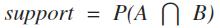
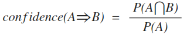
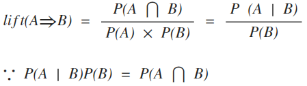

# R Association Rule

연관 규칙 학습은 대량의 데이터 변수간 관계를 발견하기 위한 rule-based machine learning 방법입니다. 예를 들어 월마트의 맥주와 기저귀 같은 여러 번 발생한 사건 내에서 일정한 규칙을 찾아내는 분석입니다.

## 연관성 규칙의 세가지 척도
### 1. 지지도 (Support)
전체 거래 중 A와 B가 동시에 얼마나 자주 거래되는지를 나타내는 비중으로 해당 규칙이 얼마나 의미 있는 규칙인지를 설명합니다.
	

> A와 B가 동시에 일어난 횟수 / 전체 거래 횟수 
> (전체 거래 중 맥주와 기저귀를 동시에 구매한 경우의 수)


### 2. 신뢰도 (Confidence)
A를 포함하는 거래 중 A와 B가 동시에 거래되는 비중으로, A를 거래 했을 때 B 거래가 발생할 확율
<p align="center">
	
</p>
> A와 B가 동시에 일어난 횟수 / A가 일어난 횟수 
> (맥주를 구매한 전체 거래 중 맥주와 기저귀를 동시에 구매한 경우의 수)

### 3. 향상도
A와 B가 동시에 거래된 비중을 A와B가 서로 독립된 사건일때 동시에 거래된 비중으로 나눈 값입니다. 즉, A와 B가 우연에 의해서 같이 거래된 확률보다 A와 B 사이의 얼마나 더 연관이 있는지를 평가하는 지표.
<p align="center">
	
</p>
> 수식 전개 : 독립사건에서의 조건부 확률 <sup>[1](#f1)</sup>

**향상도 결과 값에 따른 연관 관계**

|향상도 | 의미 | 예 |
|:---:|---|---|
|향상도 = 1 | 두 품목이 독립적인 관계 |과자와 후추|
|향상도 > 1 | 두 품목이 양의 상관 관계 |빵과 버터|
|향상도 < 1 | 두 품목이 음의 상관 관계 |지사제와 변비약|

자세한 내용은 [첨부파일](./reference/연관성_분석_박종명.doc) 참고하세요.

</br></br>
## 실습 1. DVD 대여 거래 데이터 분석 <sup>[2](#f2)</sup>
### arules 패키지 설치
R에서는 `arules`라는 패키지를 이용하여 연관규칙분석을 할 수 있다. `arules`는 최소 지지도 가지치기 알고리즘이 Apriori 알고리즘을 이용하여 연관규칙을 분석한다. 아직 arules 패키지를 R에 설치하지 않았다면 다음을 이용하여 설치한다.

```R
install.packages("arules")
library("arules")
```

### 데이터 로딩
DVD 대여 정보를 저장하고 있는 CSV 파일로 부터 데이터를 로드한다.

```R
dvd <- read.csv("dvdtrans.csv", header = TRUE, as.is = TRUE)
dvd
```

```
   ID          Item
1   1   Sixth Sense
2   1         LOTR1
3   1 Harry Potter1
4   1    Green Mile
5   1         LOTR2
6   2     Gladiator
7   2       Patriot
8   2    Braveheart
...
```

10개의 DVD 대여 거래에서 어떤 DVD가 대여되었는지를 보여주고 있다. 첫번째 열은 거래 번호, 두번째 열은 대여된 DVD 물품 정보를 보여준다. 예를 들어 첫째에서 다섯째 행까지는 1번 거래에서 다음과 같은 5개의 DVD가 동시에 대여되었음을 보여준다.

```R
dvd$Item[dvd$ID == 1]
```

```
[1] "Sixth Sense"   "LOTR1"         "Harry Potter1" "Green Mile"   
[5] "LOTR2" 
```

### 데이터 변환 - transactions 클래스로 변환
`arules` 패키지를 이용하여 연관규칙을 분석하기 위해서 `arules` 패키지가 사용하는 데이터 형태로 변화을 해주어야 한다. 먼저 DVD 물품별로 하나의 레코드로 기록된 구조를 거래 ID별로 하나의 레코드가 되도록 변환한다. 이를 위해 `split` 함수를 이용한다. `split` 함수는 첫번째 인수로 주어진 벡터의 데이터를 두번째 인수로 주어진 벡터의 요인별로 데이터를 구분하여 list를 생성해 준다. 결과에서 볼 수 있듯이 거래 ID에 따라 대여된 DVD 물품을 개별적 벡터로 분할하여 보여주고 있다.

```R
dvd.list <- split(dvd$Item, dvd$ID)
dvd.list
```

거래별로 항목 정보가 정리되었으면 arules에서 사용하는 `transaction` 클래스로 데이터를 변환해 준다. as() 함수를 이용하면 해당 데이터 구조를 정해진 클래스 데이터로 변환할 수 있다.

```R
dvd.trans <- as(dvd.list, "transactions")
dvd.trans
```

```
transactions in sparse format with
 10 transactions (rows) and
 10 items (columns)
```

위의 결과에서 알 수 있듯이 거래 정보가 10개의 거래와 총 10개의 물품으로 구성된 데이터임을 보여준다. 좀 더 자세한 정보를 알고자 하면 `summary()` 함수를 이용한다.

```R
summary(dvd.list)
```

arules 패키지가 제공하는 apriori() 함수를 이용하여 연관 규칙을 생성해 보자. apriori() 함수는 최소 지지도에 의해 가지치기를 하는 알고리즘을 이용한다.

```R
dvd.rules <- apriori(dvd.trans)
```

```
Apriori

Parameter specification:
 confidence minval smax arem  aval originalSupport maxtime support minlen maxlen
        0.8    0.1    1 none FALSE            TRUE       5     0.1      1     10
 target   ext
  rules FALSE

Algorithmic control:
 filter tree heap memopt load sort verbose
    0.1 TRUE TRUE  FALSE TRUE    2    TRUE

Absolute minimum support count: 1 

set item appearances ...[0 item(s)] done [0.00s].
set transactions ...[10 item(s), 10 transaction(s)] done [0.00s].
sorting and recoding items ... [10 item(s)] done [0.00s].
creating transaction tree ... done [0.00s].
checking subsets of size 1 2 3 4 5 done [0.00s].
writing ... [77 rule(s)] done [0.00s].
creating S4 object  ... done [0.00s].
```

앞의 예에서는 `apriori()` 함수 호출 시 별도의 매개변수 설정이 없었으므로 디폴트 값에 의해 규칙이 생성되었다. `summary()` 함수를 이용하면 연관규칙분석의 결과에 대한 요약 정보를 확인할 수 있다. 아래 결과에서 총 77개의 연관규칙이 발견되었고, 이 중 물품이 2개 관련된 연관규칙은 12개, 3개 관련된 규칙은 36개, 4개 관련된 규칙은 24개, 5개 관련된 규칙은 5개임을 알 수 있다. 또한 규칙에 포함된 물품 수에 대한 평균과 사분위수 정보도 확인할 수 있다. 발견된 규칙에 대한 지지도, 신뢰도, 향상도(lift)에 대한 요약정보와 함께 분석에 사용된 데이터와 매개변수에 대한 정보도 함께 제시하고 있다.


```R
summary(dvd.rules)
```

```
rule length distribution (lhs + rhs):sizes
 2  3  4  5 
12 36 24  5 

   Min. 1st Qu.  Median    Mean 3rd Qu.    Max. 
  2.000   3.000   3.000   3.286   4.000   5.000 

summary of quality measures:
    support         confidence          lift            count      
 Min.   :0.1000   Min.   :0.8000   Min.   : 1.190   Min.   :1.000  
 1st Qu.:0.1000   1st Qu.:1.0000   1st Qu.: 1.667   1st Qu.:1.000  
 Median :0.1000   Median :1.0000   Median : 5.000   Median :1.000  
 Mean   :0.1299   Mean   :0.9934   Mean   : 3.836   Mean   :1.299  
 3rd Qu.:0.1000   3rd Qu.:1.0000   3rd Qu.: 5.000   3rd Qu.:1.000  
 Max.   :0.6000   Max.   :1.0000   Max.   :10.000   Max.   :6.000  

mining info:
      data ntransactions support confidence
 dvd.trans            10     0.1        0.8
```

`inspect()` 함수를 이용하여 연관 규칙을 확인한다. 총 10개의 거래를 가지고 연관규칙을 분석하였으므로 한 거래에서만 물품들이 같이 대여되었어도 지지도가 0.1이 됨을 알 수 있다

```R
inspect(dvd.rules)
```

```R
     lhs                                             rhs             support confidence lift      count
[1]  {Harry Potter2}                              => {Harry Potter1} 0.1     1.0000000   5.000000 1    
[2]  {Braveheart}                                 => {Patriot}       0.1     1.0000000   1.666667 1    
[3]  {Braveheart}                                 => {Gladiator}     0.1     1.0000000   1.428571 1    
[4]  {LOTR}                                       => {Green Mile}    0.1     1.0000000   5.000000 1    
[5]  {LOTR}                                       => {Sixth Sense}   0.1     1.0000000   1.666667 1    
[6]  {LOTR}                                       => {Gladiator}     0.1     1.0000000   1.428571 1 
...
```

좀 더 유용한 연관규칙을 확인하기 위해 최소 지지도를 0.2, 그러니까 2번 이상 거래에 나타나는 연관규칙을 찾도록 한다. 대신 신뢰도는 0.6으로 낮추어 실행해 본다. 그러면 총 15개의 연관규칙을 발견하는 데, 한 물품으로 된 규칙도 3개 발견됨을 볼 수 있다.

```R
dvd.rules <- apriori(dvd.trans, parameter = list(support = 0.2, confidence = 0.6))
```

lift 기준으로 descend ordering

```R
inspect(sort(dvd.rules, by="lift", decreasing = TRUE))
```

```R
     lhs                        rhs           support confidence lift     count
[1]  {LOTR1}                 => {LOTR2}       0.2     1.0000000  5.000000 2    
[2]  {LOTR2}                 => {LOTR1}       0.2     1.0000000  5.000000 2    
[3]  {Green Mile}            => {Sixth Sense} 0.2     1.0000000  1.666667 2    
[4]  {Patriot}               => {Gladiator}   0.6     1.0000000  1.428571 6    
[5]  {Gladiator}             => {Patriot}     0.6     0.8571429  1.428571 6    
[6]  {Patriot,Sixth Sense}   => {Gladiator}   0.4     1.0000000  
... 
```

</br></br>
## 실습 2. 타이타닉 생존 데이터 분석 <sup>[3](#f3)</sup>

### The Titanic Dataset
[이곳](http://www.rdatamining.com/data)에서 tianic.raw.rdata 다운로드 받으세요. `load()` 명령어를 이용하여 데이터를 불러옵니다.

```R
load("data/titanic.raw.RData")

str(titanic.raw)
head(titanic.raw)
```

```
> str(titanic.raw)
'data.frame':	2201 obs. of  4 variables:
 $ Class   : Factor w/ 4 levels "1st","2nd","3rd",..: 3 3 3 3 3 3 3 3 3 3 ...
 $ Sex     : Factor w/ 2 levels "Female","Male": 2 2 2 2 2 2 2 2 2 2 ...
 $ Age     : Factor w/ 2 levels "Adult","Child": 2 2 2 2 2 2 2 2 2 2 ...
 $ Survived: Factor w/ 2 levels "No","Yes": 1 1 1 1 1 1 1 1 1 1 ...
> head(titanic.raw)
  Class  Sex   Age Survived
1   3rd Male Child       No
2   3rd Male Child       No
3   3rd Male Child       No
4   3rd Male Child       No
5   3rd Male Child       No
6   3rd Male Child       No
```

### Association Rule Mining

Right hand side는 rhs=c("Survived=No", "Survived=Yes") 인 데이터에 대해서만 규칙을 생성합니다.

```
rules <- apriori(titanic.raw, parameter = list(minlen=2, supp=0.005, conf=0.8), 
                 appearance = list(rhs=c("Survived=No", "Survived=Yes"), default="lhs"), 
                 control = list(verbose=F))
rules.sorted <- sort(rules, by="lift")
inspect(rules.sorted)
```
```
     lhs                                  rhs            support     confidence lift     count
[1]  {Class=2nd,Age=Child}             => {Survived=Yes} 0.010904134 1.0000000  3.095640  24  
[2]  {Class=2nd,Sex=Female,Age=Child}  => {Survived=Yes} 0.005906406 1.0000000  3.095640  13  
[3]  {Class=1st,Sex=Female}            => {Survived=Yes} 0.064061790 0.9724138  3.010243 141  
[4]  {Class=1st,Sex=Female,Age=Adult}  => {Survived=Yes} 0.063607451 0.9722222  3.009650 140  
[5]  {Class=2nd,Sex=Female}            => {Survived=Yes} 0.042253521 0.8773585  2.715986  93  
[6]  {Class=Crew,Sex=Female}           => {Survived=Yes} 0.009086779 0.8695652  2.691861  20  
[7]  {Class=Crew,Sex=Female,Age=Adult} => {Survived=Yes} 0.009086779 0.8695652  2.691861  20  
[8]  {Class=2nd,Sex=Female,Age=Adult}  => {Survived=Yes} 0.036347115 0.8602151  2.662916  80  
[9]  {Class=2nd,Sex=Male,Age=Adult}    => {Survived=No}  0.069968196 0.9166667  1.354083 154  
[10] {Class=2nd,Sex=Male}              => {Survived=No}  0.069968196 0.8603352  1.270871 154  
[11] {Class=3rd,Sex=Male,Age=Adult}    => {Survived=No}  0.175829169 0.8376623  1.237379 387  
[12] {Class=3rd,Sex=Male}              => {Survived=No}  0.191731031 0.8274510  1.222295 422
```

### Pruning Redundant Rules
위의 결과에서 규칙 2는 규칙 1에서 추가 지식을 제공하지 않습니다. 규칙 1은 모든 2 등급 아동이 살아남았다는 규칙입니다. 일반적으로 규칙 (예 : 규칙 2)이 다른 규칙의 수퍼 규칙 (예 : 규칙 1)이고 전자가 동일한 또는 낮은 리프트를 갖는 경우 이전 규칙 (규칙 2)은 중복되는 것으로 간주됩니다. 아래에서는 중복 규칙을 삭제합니다. ~~구글 번역 짱 좋아요!~~

```
redundant <- colSums(subset.matrix, na.rm=T) >= 1
which(redundant)
rules.pruned <- rules.sorted[!redundant]
inspect(rules.pruned)
```
##### 잘 안되고... 이해가 안됩니다. ㅠㅠ 나중에 다시 해보기로 하고 넘어갑니다.

```
redundant <- colSums(subset.matrix, na.rm=T) >= 1
which(redundant)
rules.pruned <- rules.sorted[!redundant]
inspect(rules.pruned)

rules.pruned = rules.sorted[-c(2, 4, 7, 8),]
rules.pruned
inspect(rules.pruned)
```
##### 2, 4, 7, 8 강제 제거!!
```
    lhs                               rhs            support     confidence lift     count
[1] {Class=2nd,Age=Child}          => {Survived=Yes} 0.010904134 1.0000000  3.095640  24  
[2] {Class=1st,Sex=Female}         => {Survived=Yes} 0.064061790 0.9724138  3.010243 141  
[3] {Class=2nd,Sex=Female}         => {Survived=Yes} 0.042253521 0.8773585  2.715986  93  
[4] {Class=Crew,Sex=Female}        => {Survived=Yes} 0.009086779 0.8695652  2.691861  20  
[5] {Class=2nd,Sex=Male,Age=Adult} => {Survived=No}  0.069968196 0.9166667  1.354083 154  
[6] {Class=2nd,Sex=Male}           => {Survived=No}  0.069968196 0.8603352  1.270871 154  
[7] {Class=3rd,Sex=Male,Age=Adult} => {Survived=No}  0.175829169 0.8376623  1.237379 387  
[8] {Class=3rd,Sex=Male}           => {Survived=No}  0.191731031 0.8274510  1.222295 422 
```

### Visualizing Association Rules

```
plot(rules)
plot(rules, method="graph", control=list(type="items"))
```

##### 주의
> 데이터로부터 높은 lift의 rule을 찾기는 쉽지만, rule을 이해하기는 어려움.  
> 도출된 rule 이 다른 경우에 대한 우의를 갖는 것은 아님 해당 데이터를 대상으로 분석 필요.

</br></br>
## 각주
<a name="f1">1)</a> Wikipedia, [독립사건에서의 조건부 확률](https://ko.wikipedia.org/wiki/%EC%A1%B0%EA%B1%B4%EB%B6%80_%ED%99%95%EB%A5%A0)

<a name="f2">2)</a> 열려있는 소프트웨어 이야기, [R을 이용한 연관규칙분석 실습](http://blog.daum.net/sys4ppl/6)

<a name="f3">3)</a>RDataMining.com, [Association Rule Examples](http://www.rdatamining.com/examples/association-rules)

## 참고자료
[1) R을 사용한 연관성 분석 (association rules in R)](http://www.dodomira.com/2016/02/15/r%EC%9D%84-%EC%82%AC%EC%9A%A9%ED%95%9C-%EC%97%B0%EA%B4%80%EC%84%B1-%EB%B6%84%EC%84%9D-association-rules-in-r/)


